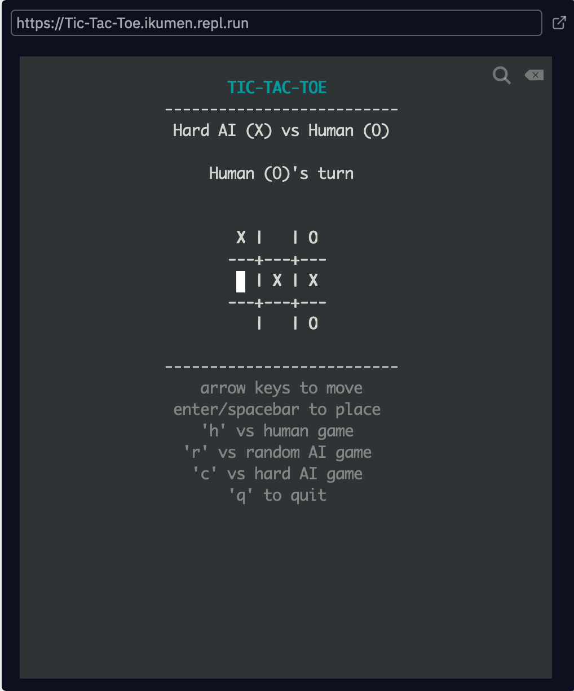

# Tic-Tac-Toe

Terminal ([Python curses](https://docs.python.org/3/howto/curses.html)) based tic-tac-toe implementation demonstrating [minimax algorithm](https://en.wikipedia.org/wiki/Minimax).



You can check out game ( [https://tic-tac-toe.ikumen.repl.run/](https://tic-tac-toe.ikumen.repl.run/) ) on `Repl.it` or run it locally.

```python
python main.py
```

[](https://repl.it/github/ikumen/terminal-tictactoe) 

